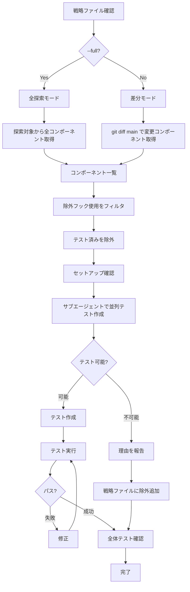

# Test React Components

`app/components/` のReactコンポーネント単体テストを作成・実行する。

メインエージェントは司令塔として動作し、実際の作業はサブエージェントに委任する。


## 引数

- `--full` - 全探索モード (探索対象ディレクトリ内の全コンポーネントを対象)
- 引数なし - 差分モード (main ブランチとの差分コンポーネントのみ対象)


## フロー図




## 準備: 戦略ファイルを確認

最初に `.claude/strategies/test-react-components.md` を確認する。

ファイルが存在しない場合は、コードベースを探索して作成する。

戦略ファイルには以下が定義されている:

- 探索対象ディレクトリ
- 除外フック一覧
- テスト対象外
- 発生した問題


## フェーズ1: コンポーネント一覧を取得


### 差分モード (デフォルト)

main ブランチとの差分からコンポーネントファイルを取得する。

```bash
git diff --name-only main -- 'app/components/**/*.tsx' | grep -v '\.test\.tsx$' | grep -v '/ui/'
```


### 全探索モード (--full)

探索対象ディレクトリから全コンポーネントを取得する。

```bash
find app/components -name "*.tsx" -not -name "*.test.tsx" -not -path "*/ui/*"
```


## フェーズ2: 除外フィルタ

戦略ファイルの除外フックを使用しているコンポーネントを除外する。

```bash
EXCLUDE_HOOKS="useLoaderData\|useParams\|useSearchParams\|useNavigate\|useLocation\|useFetcher\|useMatches\|useLang\|useHref\|useHome\|useTranslationTag\|useTranslationData\|useParkingTranslationTag\|useUrlParams\|useUrlParamArray\|useAnchorSmoothScroller\|useSectionScrollNavigation\|useExcludedPage\|useKlookUrl\|useIsMobile\|useTicketStock"

grep -rl "$EXCLUDE_HOOKS" app/components --include="*.tsx" | grep -v "\.test\.tsx"
```

既存の *.test.tsx ファイルを探し、対応するソースファイルをテスト済みとして除外する。


## フェーズ3: セットアップ確認

依存関係がインストール済みか確認。

```bash
bun pm ls | grep -E "(testing-library|happy-dom)"
```

未インストールの場合:

```bash
bun add -D @testing-library/react @testing-library/dom happy-dom
```

`tests/setup-dom.ts` と `bunfig.toml` が存在することを確認。


## フェーズ4: 並列でテスト作成

残ったコンポーネントごとにサブエージェント (general-purpose) を並列起動する。

各サブエージェントへの指示:

```
ファイル: {コンポーネントファイルパス}

このコンポーネントを読んで以下を判断する:

テスト可能な条件:
- 除外フックを使用していない
- props で動作が制御される
- UIレンダリングが確認できる

テスト不可能な条件:
- 除外フックを使用している
- 外部APIに依存している
- 複雑な状態管理に依存している

テスト可能な場合:
- 同じディレクトリに *.test.tsx を作成
- bun:test + @testing-library/react を使用
- テストタイトルは日本語
- 作成したテストファイルのパスを報告

テスト不可能な場合:
- 理由を具体的に報告
- ファイルパスと理由のペアで報告
```


## フェーズ5: テスト実行と修正

```bash
bun test app/components
```

失敗したテストがあれば修正する。

全テストがパスするまで繰り返す。


## フェーズ6: 全体テスト確認

全体のテストを実行して、他のテストに影響がないことを確認する。

```bash
bun test
```

よくある問題:

- グローバル環境 (window, document) を上書きするテストが他に影響
- `beforeAll` / `afterAll` で環境を保存・復元していない


## テスト作成ルール

- `bun:test` から `test` と `expect` を使用
- `@testing-library/react` から `render`, `screen` を使用
- テストタイトルは日本語
- ファイル名: `*.test.tsx`
- 同じディレクトリに配置
- 1テスト1アサーション


## テンプレート

```typescript
import { expect, test } from "bun:test"
import { render, screen } from "@testing-library/react"
import { Button } from "./button"

test("正常系: デフォルトのボタンをレンダリングする", () => {
  render(<Button>Click me</Button>)
  const button = screen.getByRole("button", { name: "Click me" })
  expect(button).toBeDefined()
})

test("正常系: variant=orange でスタイルが適用される", () => {
  render(<Button variant="orange">Submit</Button>)
  const button = screen.getByRole("button")
  expect(button.className).toContain("bg-orange")
})

test("正常系: disabled 属性が適用される", () => {
  render(<Button disabled>Disabled</Button>)
  const button = screen.getByRole("button")
  expect(button.hasAttribute("disabled")).toBe(true)
})
```


## Link を含むコンポーネント

react-router の `Link` を使用するコンポーネントは `MemoryRouter` でラップする。

```typescript
import { MemoryRouter } from "react-router"

test("正常系: リンクがレンダリングされる", () => {
  render(
    <MemoryRouter>
      <DocLink href="/test">リンク</DocLink>
    </MemoryRouter>
  )
  expect(screen.getByRole("link")).toBeDefined()
})
```


## クエリ優先順位

1. `getByRole` - アクセシビリティロール
2. `getByLabelText` - フォーム要素
3. `getByText` - テキストコンテンツ
4. `getByTestId` - 最終手段


## 戦略ファイルの更新

テスト作成中に以下を発見したら `.claude/strategies/test-react-components.md` を更新する:

- 新しい除外フック
- テスト対象外コンポーネントと理由
- 発生した問題 (エラー、ワークアラウンドなど)
