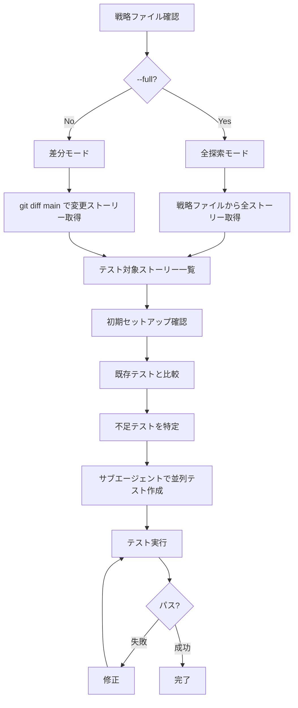

# Test Stories

ユーザーストーリーからE2Eテストを作成・実行する。

メインエージェントは司令塔として動作し、実際の作業はサブエージェントに委任する。


## 引数

- `--full` - 全探索モード (戦略ファイルの全ストーリーを対象)
- 引数なし - 差分モード (main ブランチとの差分ストーリーのみ対象)


## フロー図




## 準備: 戦略ファイルを確認

最初に `.claude/strategies/test-stories.md` を確認する。

ファイルが存在しない場合は、以下の手順で作成する:

- ストーリーファイルのディレクトリを特定
- ストーリー一覧を作成
- 戦略ファイルを作成

戦略ファイルには以下が定義されている:

- `STORIES_DIR` - ストーリーファイルのディレクトリ
- テスト対象外


## フェーズ1: テスト対象ストーリーを特定


### 差分モード (デフォルト)

main ブランチとの差分からストーリーファイルを取得する。

```bash
# STORIES_DIR は戦略ファイルで定義されたパス
git diff --name-only main -- '${STORIES_DIR}/*.md'
```


### 全探索モード (--full)

参照ドキュメントのディレクトリ内の全ストーリーを対象とする。

```bash
# STORIES_DIR は戦略ファイルで定義されたパス
ls ${STORIES_DIR}/*.md
```


## フェーズ2: 初期セットアップ確認


### playwright.config.ts

存在しない場合は作成。`stories` プロジェクトの設定:

- `video: "off"`
- `screenshot: "off"`
- `fullyParallel: true`
- `workers: 4` (ローカル) / `2` (CI)
- `reuseExistingServer: true`


### .gitignore

以下のエントリがなければ追加:

```
test-results/
playwright-report/
```


## フェーズ3: 不足テストを特定

```bash
# ストーリーファイル一覧 (STORIES_DIR は戦略ファイルで定義)
ls ${STORIES_DIR}/*.md | xargs -I {} basename {} .md | sort > /tmp/stories.txt

# 既存テスト一覧
ls tests/stories/*.e2e.ts 2>/dev/null | xargs -I {} basename {} .e2e.ts | sort > /tmp/story-tests.txt

# 不足テスト
comm -23 /tmp/stories.txt /tmp/story-tests.txt
```


## フェーズ4: 並列でテスト作成

不足ストーリーごとにサブエージェント (general-purpose) を並列起動する。

各サブエージェントへの指示:

```
ストーリー: {ストーリーファイルパス}

このストーリーを読んでE2Eテストを作成する:

手順:
1. ストーリーファイルを読み込む
2. FrontMatter (persona: または test-aspect:) を確認
3. 各ステップで agent-browser を使ってページ構造を確認
4. tests/stories/<story-name>.e2e.ts にテストを作成

テンプレート:
import { expect, test } from "@playwright/test"

test.describe("ストーリー名 @persona:xxx", () => {
  test("ステップの説明", async ({ page }) => {
    await page.goto("/", { waitUntil: "domcontentloaded" })
    // テスト内容
  })
})

FrontMatterによる分類:
- persona: 国内来園者 → @persona:domestic
- test-aspect: 多言語対応 → @test-aspect:i18n

作成したテストファイルのパスを報告する。
```


### 命名規則

- ストーリー: `${STORIES_DIR}/<story-name>.md`
- テスト: `tests/stories/<story-name>.e2e.ts`


## フェーズ5: テスト実行と修正


### 差分モード

変更されたストーリーのみテスト:

```bash
bunx playwright test --project=stories -g "story1|story2"
```


### 全探索モード

全ストーリーテスト:

```bash
bunx playwright test --project=stories
```

失敗したテストがあれば修正する。

全テストがパスするまで繰り返す。


## 戦略ファイルの更新

テスト作成中に以下を発見したら `.claude/strategies/test-stories.md` を更新する:

- テスト対象外ストーリーと理由
- 発生した問題 (エラー、ワークアラウンドなど)
